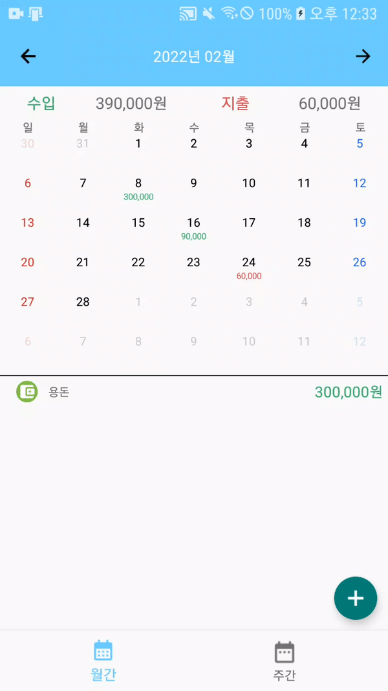
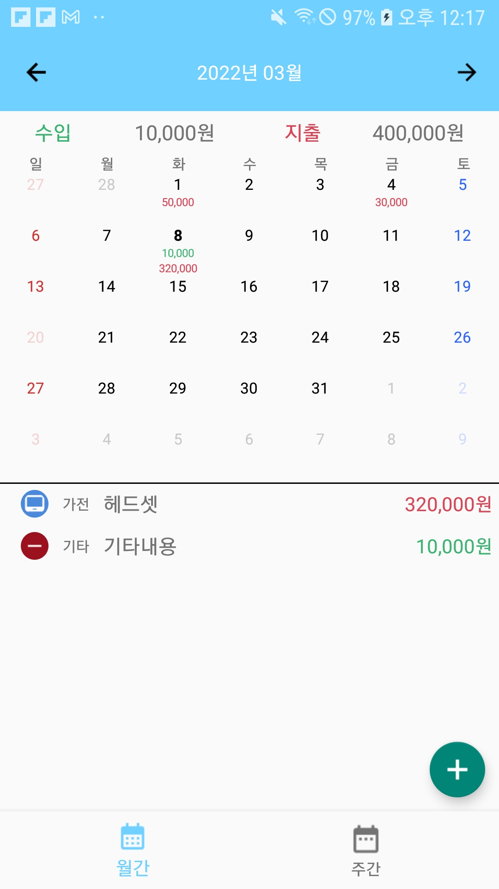
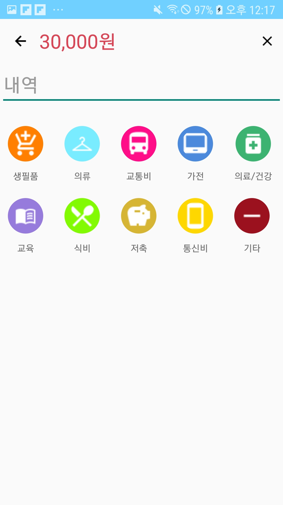
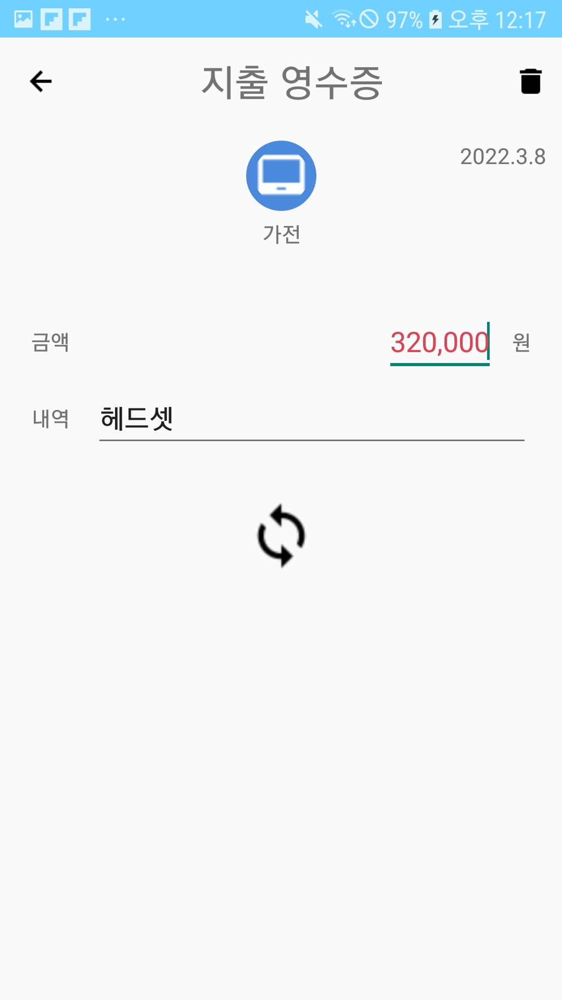
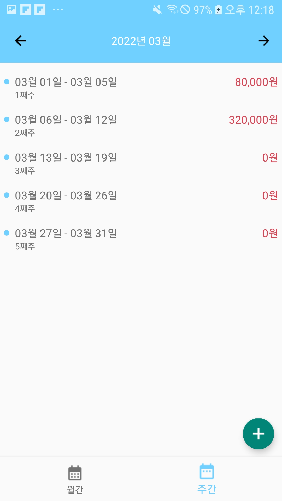

# 서비스 소개

안드로이드 AAC와 여러 라이브러리를 MVVM 패턴으로 적용하며 코드를 작성하였습니다. 이를 위해 여러가지 안드로이드 샘플 소스 및 깃허브 레포를 확인하고 공부하였습니다. 완벽한 앱은 아니지만 계속해서 리팩토링하며 유지보수를 높이고, 기능을 추가하며 여러 안드로이드 라이브러리를 사용할 예정입니다.

 

# 앱 스크린샷

 

&ensp;

 

&ensp;

 

# 라이브러리

* [Android KTX](https://developer.android.com/kotlin/ktx)
* [LiveData](https://developer.android.com/topic/libraries/architecture/livedata)
* [Room](https://developer.android.com/training/data-storage/room)
* [ViewModel](https://developer.android.com/topic/libraries/architecture/viewmodel)
* [Hilt](https://developer.android.com/training/dependency-injection/hilt-android)
* [CircleImageView](https://github.com/hdodenhof/CircleImageView)
* [Joda-Time](https://github.com/dlew/joda-time-android)

 

# Architecture

MVVM

 

# 주요 기능

* ViewModel과 LiveData를 사용하여 View(액티비티, 프래그먼트)의 데이터를 관리하고 Model(Repository)에서 데이터를 획득하였습니다.
* Hilt를 통해 Depedency Injection을 처리하였습니다.
* Room을 통해 로컬 데이터베이스를 관리하였습니다.
* 자바의 Date, Calendar 클래스대신 Joda-time 라이브러리를 사용하여 날짜를 관리했습니다.

 

# 막힌 점

* CustomCalendarView

처음 Calendar를 구현할 때, Custom으로 Calendar를 구현하고 ViwePager2를 통해 스와이프 달력의 스크롤(스와이프) 기능을 구현하려고 했습니다. 다만, 이벤트와 데이터를 셋팅하는 부분에서 막혀서 GridView와 ArrayAdapter를 통해 기능을 구현하였습니다. 추후, CustomView에 대해 더 공부하여 ViewPager2를 통해 기능을 변경해보려고 합니다.

 

# 추가할 기능

* Coroutine

현재 Room 데이터베이스의 CRUD 기능을 Executors를 사용하여 처리하였지만 Kotlin Coroutine을 공부하여 이를 통해 데이터베이스의 CRUD 기능을 처리하려고 합니다.

* NavigationView

FragmentManger와 FragmentTransaction을 통해 Fragment를 생성 및 관리하고 있는데 이를 NavigationView로 변경하려고 합니다.

* Paging

RecyclerView의 Adapter를 통해 RecyclerView의 데이터를 관리하고 있는데 이를 Paging으로 변경하려고 합니다.

* 테스트 코드를 추가하려고 합니다.